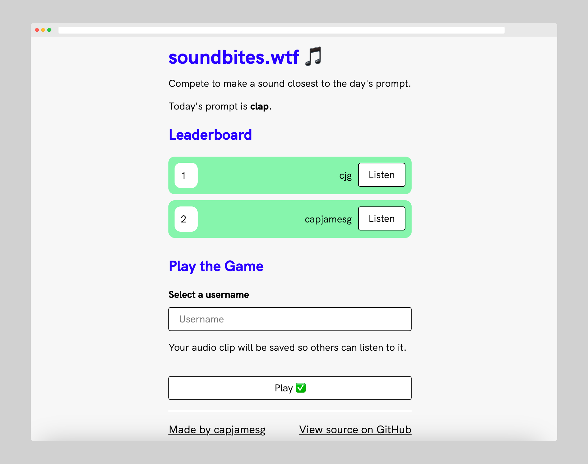

# soundbites.wtf

[soundbites.wtf](https://soundbites.wtf) is a game to see who can record a noise most like the day's prompt.

soundbites.wtf is inspired by [paint.wtf](https://paint.wtf/).

The audio comparison functionality in this project is powered by LAION's [CLAP](https://github.com/LAION-AI/CLAP) (Contrastive Language-Audio Pretraining) model.

## License

This project is licensed under an [MIT license](LICENSE).

## Contributors

- capjamesg